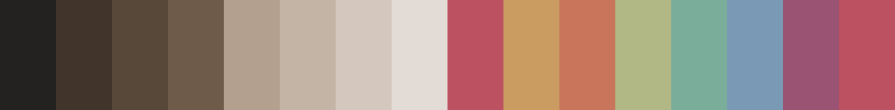

# *Spirited: A colorful, cozy scheme*

*Spirited* is a set of [Base16](https://github.com/chriskempson/base16?tab=readme-ov-file) color schemes inspired by Spirited Away, Hayao Miyazaki's 2001 animated film produced by Studio Ghibli.

### *Spirited Haku Dark*

### *Spirited Haku Dark eXtra Contrast*

### *Spirited Chihiro Dark*

### *Spirited Chihiro Dark eXtra Contrast*

